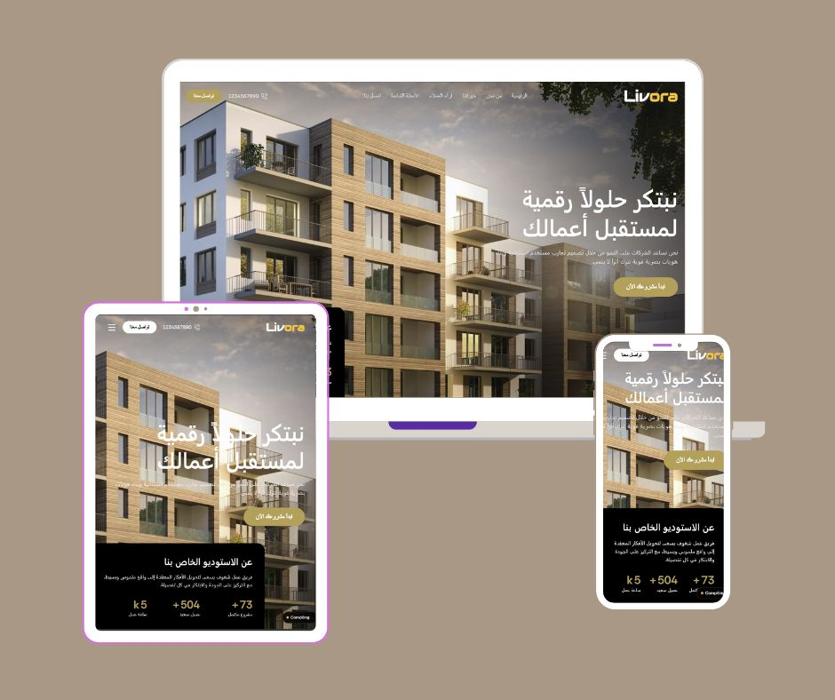

# 🏛️ ليفورا (Livora) | استوديو التصميم المعماري والحلول الرقمية الإبداعية

منصة ويب فاخرة وعصرية تم بناؤها باستخدام **Next.js** لتقديم خدمات التصميم المعماري، الديكور الداخلي، والحلول الرقمية بأسلوب "Minimalist" يجمع بين الفخامة والبساطة.

---

### 🖼️ الصفحة الرئيسية (Hero Section)

## ✨ المميزات (Features)

* **💎 تصميم فخم (Luxury UI):** واجهة مستخدم تعتمد على المساحات المفتوحة والخطوط الراقية لتعزيز هوية العلامة التجارية.
* **📱 تجربة مستخدم متكاملة:** تصميم متجاوب (Responsive) بالكامل يضمن تصفحاً سلساً من الجوال وحتى الشاشات العملاقة.
* **🌍 دعم كامل للغة العربية (RTL):** هيكلية برمجية مدروسة تدعم القراءة من اليمين إلى اليسار مع خطوط متناسقة.
* **📊 إحصائيات حية:** عدادات تفاعلية للمشاريع والعملاء باستخدام `React-CountUp`.
* **🔄 سلايدر تفاعلي:** نظام استعراض لآراء العملاء (Testimonials) مدعوم بـ Swiper JS مع دعم السحب واللمس.
* **✉️ نموذج تواصل ذكي:** نظام مراسلة مدمج وسهل الاستخدام للعملاء المحتملين.

---

### 🏗️ قسم من نحن والخبرات (About & Expertise)

## 🛠️ التقنيات المستخدمة (Tech Stack)

* **Framework:** [Next.js 15](https://nextjs.org/) (App Router)
* **Styling:** [Tailwind CSS](https://tailwindcss.com/)
* **Animations:** [React CountUp](https://github.com/glennreyes/react-countup)
* **Slider:** [Swiper.js](https://swiperjs.com/)
* **Icons:** [Bootstrap Icons](https://icons.getbootstrap.com/)
* **Fonts:** Rethink Sans & DM Sans (تنسيق مخصص للعربية)

---

### 💬 آراء العملاء والأسئلة الشائعة (Testimonials & FAQ)

## 🚀 التشغيل المباشر (Quick Start)

اتبع الخطوات التالية لتشغيل مشروع **ليفورا** محلياً على جهازك:

